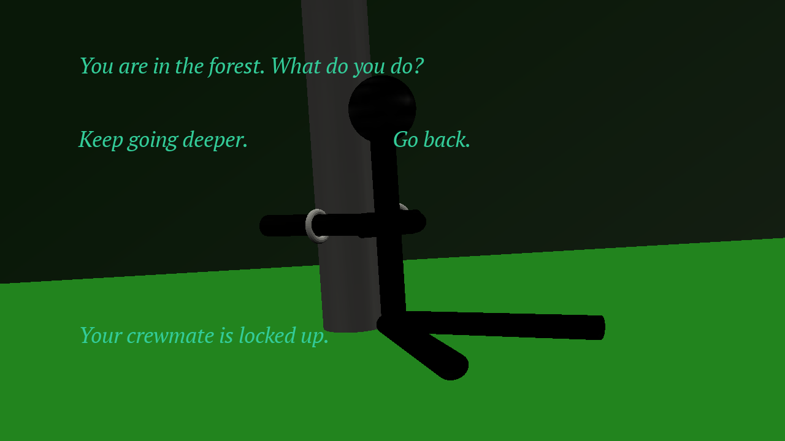

# Pirate Escape

Author: David Lyons

Design: A choose-your-own adventure story about a pirate in a desperate situation.

Text Drawing: The text is rendered at runtime. When the game boots, I initialize the font.
Based on the whatever state the game is in, I decide what text should be displayed, and then
I use Harfbuzz and FreeType to shape and render the glyphs. I then use OpenGL to draw this text
with each glyph on its own texture and display it.

Choices: I do a modification of a state machine. I have a Location enum for where you are and an
items list for what Item objects you have, as well as a few booleans. I store four messages. One is
based on your location. The next two are your left and right choices, and the last is the result of
the previous choice. When you make a choice, based on your location, your items, and the choice you
made, you will get a new set of messages. 

Screen Shot:

How To Play:

Your name is Captain Niatpac, and you are one of the most feared pirates in the sea. 
Unfortunately, a terrible storm left you shipwrecked on the coast of Port Trop, 
a city notorious for hating pirates and treating them like the worst criminals. 
You've been separated from your crew, most of whom have probably already been killed, 
and you are trapped in the dungeon. Your goal is to escape, make it to shore, 
and commandeer a ship off the island.

At each stage, you will be given two choices, one on the left and one on the right.
The arrow keys control your choice. If you lose, press R to restart. If you're
curious about some other paths or strategies, dist/guide.txt has the explanation.

Sources: 

Learned how to use Harfbuzz and FreeType from these tutorials & api sources:
https://github.com/harfbuzz/harfbuzz-tutorial/blob/master/hello-harfbuzz-freetype.c
https://freetype.org/freetype2/docs/tutorial/step1.html
https://harfbuzz.github.io/
https://freetype.org/freetype2/docs/reference/index.html

Learned how to go from FreeType to OpenGL (and used some code) from this tutorial:
https://learnopengl.com/In-Practice/Text-Rendering

Font PT Serif from ParaType licensed under the Open Font License.

This game was built with [NEST](NEST.md).

